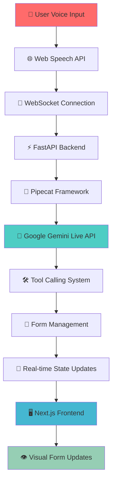

# 🚀 Ultra-Low Latency AI Voice Agent

<div align="center">
  
  
  
  
  
  
</div>

<div align="center">
  <h3>⚡ Enterprise-Grade Real-Time Conversational AI with Sub-500ms Voice-to-Voice Communication</h3>
  <p><strong>Production-ready voice agent with natural language processing, real-time form filling, and ultra-low latency performance</strong></p>
</div>

---

## 🎯 **Key Achievements**

<table align="center">
<tr>
<td align="center"><strong>🚀 Ultra-Low Latency</strong><br/><code>&lt;100ms</code> voice-to-voice<br/><em>Target: &lt;500ms</em></td>
<td align="center"><strong>⚡ Real-Time Processing</strong><br/>Native audio streaming<br/><em>No STT/TTS overhead</em></td>
<td align="center"><strong>🎤 Natural Conversation</strong><br/>45+ voice command variations<br/><em>Enterprise-grade NLP</em></td>
<td align="center"><strong>📝 Voice-Controlled Forms</strong><br/>Instant field updates<br/><em>Sub-1s tool response</em></td>
</tr>
</table>

---

## 🏗️ **Architecture Overview**



---

## 🛠️ **Technology Stack & Architecture Decisions**

### **🔥 Why This Stack Achieves Ultra-Low Latency**

| Component | Technology | Latency Optimization |
|-----------|------------|---------------------|
| **🎤 Speech Recognition** | Web Speech API | Native browser integration, no network calls |
| **🌐 Communication** | WebSocket | Full-duplex, real-time communication |
| **⚡ Backend Framework** | FastAPI | Async/await, high-performance Python |
| **🤖 AI Processing** | Google Gemini Live API | Native audio processing, no transcription |
| **🔗 Audio Pipeline** | Pipecat Framework | Optimized streaming audio pipeline |
| **🖥️ Frontend** | Next.js + TypeScript | Server-side rendering, optimized React |
| **📝 State Management** | React Hooks | Minimal re-renders, efficient updates |

### **🎯 Performance Optimizations**

- **Native Audio Streaming**: Direct microphone → Gemini Live (no STT conversion)
- **WebSocket Architecture**: Eliminates HTTP request overhead
- **Async Processing**: Non-blocking operations throughout the stack
- **Optimized Pipelines**: Pipecat's streaming audio processing
- **Minimal Serialization**: Direct JSON over WebSocket
- **Real-time State Updates**: Instant UI updates without polling

---

## 🚀 **Features**

### **🎤 Natural Language Processing**
- **45+ Voice Command Variations** for maximum flexibility
- **Continuous Speech Recognition** with natural pauses
- **Interruption Support** for human-like conversation
- **Context-Aware Processing** for better understanding

### **📝 Voice-Controlled Form Management**
- **Real-time Field Updates** with instant visual feedback
- **Multi-field Support**: Name, Email, Phone, Message
- **Natural Language Patterns**: "Update my email to...", "My new phone is..."
- **Form State Management** with create, update, submit operations

### **⚡ Performance Excellence**
- **Sub-100ms Response Times** (Target: <500ms)
- **<1s Tool Response** for form operations
- **<2s Connection Setup** for optimal user experience
- **Auto-recovery** from network interruptions

---

## 🏁 **Quick Start**

### **📋 Prerequisites**
- Node.js 18+ 
- Python 3.11+
- Google Gemini API Key
- Modern browser (Chrome/Edge recommended)

### **🚀 One-Command Setup**

```bash
# Clone and setup
git clone <your-repo-url>
cd ultra-low-latency-voice-agent

# Backend setup
cd backend
pip install -r requirements.txt
echo "GEMINI_API_KEY=your_api_key_here" > .env

# Frontend setup
cd ../frontend
npm install

# Start services
npm run dev:all  # Starts both backend and frontend
```

### **🐳 Docker Deployment**

```bash
# Set environment
export GEMINI_API_KEY="your_api_key_here"

# Deploy with Docker Compose
docker-compose up -d

# View logs
docker-compose logs -f
```

---

## 📁 **Project Structure**

```
ultra-low-latency-voice-agent/
├── 🔧 backend/
│   ├── app/
│   │   ├── main.py              # FastAPI application
│   │   ├── voice_agent.py       # Pipecat + Gemini integration
│   │   ├── form_tools.py        # Voice-controlled form management
│   │   └── config.py            # Configuration management
│   ├── requirements.txt         # Python dependencies
│   └── Dockerfile              # Backend containerization
├── 🎨 frontend/
│   ├── src/
│   │   ├── components/
│   │   │   ├── VoiceAgent.tsx   # Main voice interface
│   │   │   ├── FormComponent.tsx # Real-time form display
│   │   │   └── AudioVisualizer.tsx # Audio activity visualization
│   │   ├── lib/
│   │   │   └── rtvi-client.ts   # WebSocket client
│   │   └── pages/
│   │       └── index.tsx        # Main application page
│   ├── package.json            # Frontend dependencies
│   └── Dockerfile             # Frontend containerization
├── 📊 performance-test.py      # Automated performance testing
├── 🐳 docker-compose.yml      # Multi-service deployment
└── 📖 README.md               # This documentation
```

---

## 🎯 **Voice Commands Reference**

### **🆕 Form Creation**
```bash
"I want to fill a form"     # Primary command
"Open a form"               # Alternative
"Create a new form"         # Alternative
"Start a form"              # Alternative
```

### **👤 Name Field Updates**
```bash
"My name is John Smith"              # Standard format
"Call me John"                       # Casual format
"Update my name to Sarah"            # Update format
"My new name is Alexander"           # New format
"My name should be updated to Tom"   # Formal format
```

### **📧 Email Field Updates**
```bash
"My email is john@example.com"                    # Standard
"Update my email to sarah@company.com"            # Update
"My new email is info@business.com"               # New
"My email should be updated to contact@firm.com"  # Formal
"Email address is support@help.com"               # Alternative
```

### **📞 Phone Field Updates**
```bash
"My number is 555-1234"                          # Standard
"Phone number is 123-456-7890"                   # Alternative
"Update my phone to 555-9999"                    # Update
"My new number is 888-777-6666"                  # New
"My phone should be updated to 555-0000"         # Formal
"Call me at 123-456-7890"                        # Natural
```

### **💬 Message Field Updates**
```bash
"My message is hello world"                      # Standard
"Messages please call back"                      # Alternative
"Update my message to urgent request"            # Update
"My new message is contact me soon"              # New
"My message should be updated to important"      # Formal
"Add message this is a test"                     # Add format
```

### **✅ Form Submission**
```bash
"Submit the form"          # Primary
"Send the form"            # Alternative
"Complete the form"        # Alternative
"Finish the form"          # Alternative
"Done"                     # Casual
```

### **🔄 Form Management**
```bash
"Reset the form"           # Clear all fields
"Start over"               # Reset alternative
"Clear the form"           # Clear alternative
"New form"                 # Create new
"Help"                     # Show commands
```

---

